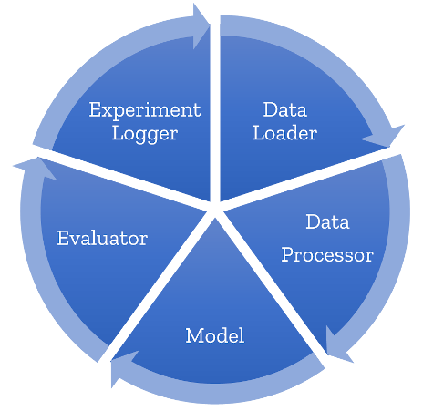

# Fabric ML

Generic experimentation framework for data scientists and data science teams.
It provides a quick starter code for reproducible machine learning.



## TL;DR: What does this framework do

- First, it builds on top of the awesome
[CookieCutter-DataScience](https://drivendata.github.io/cookiecutter-data-science/) template which takes care of your project structure and python package setup.
- Then, it provides functionality for conducting rigorous experimentation: structured, reproducible and robust.

It does so by providing these main capabilities:

1. **Collaborate** easily by defining a clear structure to the main building blocks used during model experimentation
2. **Experiment** easily by defining a project template for all Jupyter notebooks
3. **Reproduce** easily by automagically adding experiment logging capabilities to every experiment
4. **Productize** easily by defining code in classes (with defined APIs) and inherently creating data pipelines

## How to install
To create a new package for a new experiment:

a. Install `cookiecutter` (preferably in a virtual environment):
```
pip install cookiecutter
```

or

```
conda config --add channels conda-forge
conda install cookiecutter
```

b. In an empty folder, generate the folder structure and prebuilt classes:

```sh
cookiecutter MY_REPO (TODO: replace with mlfabric repo once published)
```

c. From the new repository folder, install requirements:

```sh
pip install -e .
```

## Getting started

Easiest way to get started is to generate a notebook from a template,
and implement the basic building blocks (loading data, preprocessing, modeling).

The notebook template is a markdown file which can be used to set up new experiments easier. 
The template is written in a text file so it is easier to maintain on source control.

For an example template, [see this template](<{{ cookiecutter.repo_name }}/notebook_templates/example_template.md>).

To generate a new notebook:

```sh
python generate_notebook --name my_new_notebook.ipynb
```

## Why use this framework

### Define a clear structure for the main building blocks

- **DataLoader**: Unified code for getting data
- **DataProcessor**: For data preprocessing, feature engineering and postprocessing
- **BaseModel**: scikit-learn like API wrapper for all models
- **Evaluator**: Define your metrics in an explicit and traceable way
- **ExperimentRunner**: Runs an entire cycle, from data loading,
through preprocessing, model fit, predict and evaluate on new data.
In addition, it takes parameters and metrics from all of the above
and stores a unified and reproducible representation of your experiment.

### Provide a project template for all Jupyter notebooks

All notebooks look the same: Get the data, preprocess it, fit a model, evaluate.
Why not make this standardized so you won't have any errors?

### By getting experiment logging for free

The experiments are structured in a way, that you will always be able to reproduce any experiment,
as code, hyperparams, data versions and metrics are stored using your favorite experiment logger (mlflow or others)

### By leveraging the CookieCutter Data science project structure

- docs: <https://drivendata.github.io/cookiecutter-data-science/>
- folder structure: <https://github.com/drivendata/cookiecutter-data-science/#the-resulting-directory-structure>

## Contributing

This project welcomes contributions and suggestions. Most contributions require you to agree to a Contributor License Agreement (CLA) declaring that you have the right to, and actually do, grant us the rights to use your contribution. For details, visit <https://cla.microsoft.com.>

When you submit a pull request, a CLA-bot will automatically determine whether you need to provide a CLA and decorate the PR appropriately (e.g., label, comment). Simply follow the instructions provided by the bot. You will only need to do this once across all repos using our CLA.

This project has adopted the Microsoft Open Source Code of Conduct. For more information see the Code of Conduct FAQ or contact opencode@microsoft.com with any additional questions or comments.
